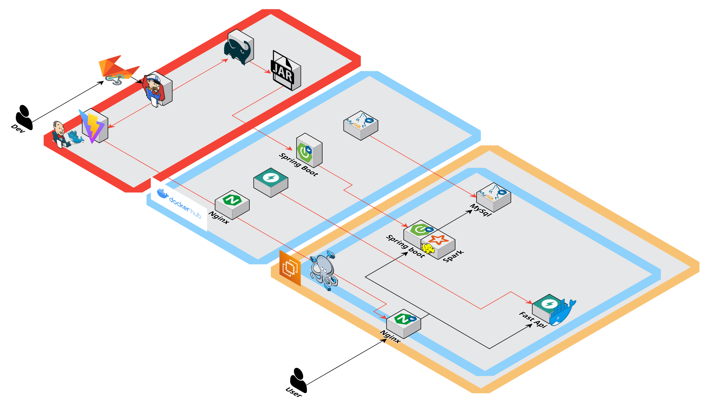
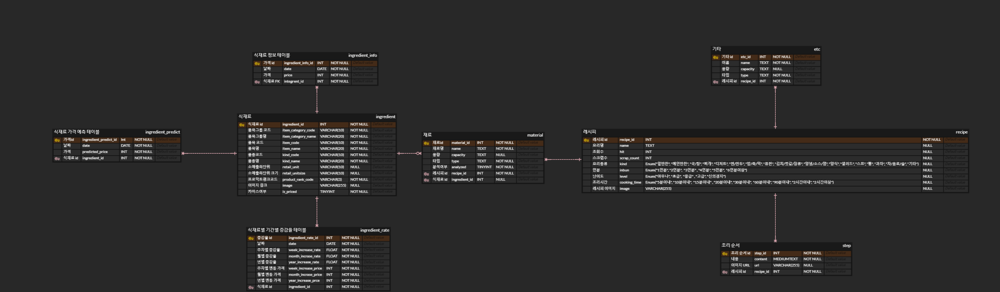

#  미정(味定)

> 백치미 (구미 1반 7조 D107)
>
> 미정(味定)
>
> 프로젝트 기간 : 2024.08.19~ 2024.10.11 (8주)

  <a href="https://www.notion.so/tassel/D107-107-34da1704badc460b8bcb6942605d4b08?pvs=4">노션</a>
    |    
  <a href="https://www.figma.com/design/AadeSeq0rUmGmh0HFIoyka/Untitled?node-id=0-1&t=5W5GnKDlhCzaIu3j-0">피그마</a>

## 👇 미정(味定) 소개 및 시연 영상 👇

[](https://file.notion.so/f/f/5dd88902-74d6-4473-8ddd-8fa9e78b1bf1/898cb0bf-1c5f-48a3-a72a-ae66be4501e2/11%EA%B8%B0_%ED%8A%B9%ED%99%94PJT_%EC%98%81%EC%83%81_%ED%8F%AC%ED%8A%B8%ED%8F%B4%EB%A6%AC%EC%98%A4_D107.mp4?table=block&id=597f7aa3-3ed9-4b81-9861-d875a9b4d904&spaceId=5dd88902-74d6-4473-8ddd-8fa9e78b1bf1&expirationTimestamp=1728777600000&signature=YRHa67cK7ctJQAse1CrtEQfYFXvnDy09CFRaROFS_zQ&downloadName=11%EA%B8%B0_%ED%8A%B9%ED%99%94PJT_%EC%98%81%EC%83%81_%ED%8F%AC%ED%8A%B8%ED%8F%B4%EB%A6%AC%EC%98%A4_D107.mp4)

미정(味定) 시나리오는 👉[여기](https://www.notion.so/tassel/b615636bcacb4165a24c6d3ba2e9e7fa?pvs=4)👈에서 더 자세히 보실 수 있습니다.

 
 

# :rice_ball: 미정(味定) 서비스 설명

### 📌 개요

**사용자가 현재 식재료 가격 변동을 확인하고, 연관된 식재료와 레시피를 추천받아 합리적이고 맛있는 요리를 준비할 수 있도록 도와주는 통합 플랫폼입니다.
분산처리를 활용하여 대용량 데이터를 효율적으로 분석하고,
사용자에게 맞춤형 추천을 제공합니다.**

### 💡 미정(味定) 목적

- 물가 변동을 확인하여 저렴한 식재료를 한눈에 확인할 수 있습니다.
- 사용자가 원하는 식재료에 맞는 레시피를 추천 받을 수 있습니다.
- 사용자가 원하는 식재료와 많이 쓰이는 식재료를 추천 받을 수 있습니다.

### <u>🍀 사용자에게 식재료 시세와 레시피 제공</u>

**🙋🏻‍♂️ 사용자 목표**

> 요리를 좋아하는 사람들이 온라인으로 식재료에 가격 정보와 레시피에 대한 정보를 얻을 수 있는 플랫폼

## 🖥️ 미정(味定) 서비스 화면

### 랜딩 페이지

### 메인화면 - 식재료 가격

### 식재료 - 목록, 검색

### 식재료 상세보기 - 식재료 정보, 식재료 가격추이 그래프, 네트워크 그래프, 레시피 추천

### 레시피 - 목록, 검색

### 레시피 상세보기 - 레시피 재료, 조리 방법, QR코드

### 나만의 요리 도우미 - 식재료 추가, 삭제, 검색

### 나만의 요리 도우미 - 식재료 추천

### 나만의 요리 도우미 - 추천 레시피

### 찜한 레시피

 
 

## 🔎 주요 기능

- 식재료 가격 제공
- 식재료 목록 검색
  - 검색어 자동완성
- 식재료 가격 추이 그래프
  - 시계열 분석
- 식재료 네트워크 그래프
  - 코사인 유사도
- 레시피 목록 검색
  - 검색어 자동완성
- 선택한 식재료 기반 식재료/레시피 추천
  - 식재료 추천 : 연관성 분석(장바구니 분석)
  - 레시피 추천 : 코사인 유사도

### 기술 관점

- CI/CD 파이프라인 구축 및 배포 자동화
- FrntEnd, BackEnd, DB를 각 docker 컨테이너로 관리하여 빌드 및 배포를 통해 안정적인 CI / CD 구축
- 코사인 유사도 :
- 장바구니 분석 : 장바구니 연관 규칙 기반 추천 시스템을 사용하여 레시피에 사용된 식재료와 관련된 패턴을 분석하여, 사용자가 선택한 식재료와 레시피에서 많이 사용된 식재료를 추천합니다. Apache Spark의 FPGrowth 알고리즘을 활용하여 대규모 데이터를 빠르게 분석합니다.
- 시계열 분석 :

- 사용자 맞춤형 시각화 도구 : 네트워크 그래프, 시세 차트 등 다양한 시각화 도구를 사용하여 데이터를 직관적으로 표현하고, 사용자 경험을 개선합니다.

### 기능 관점

- 가격 변동 분석 : 사용자가 식재료에 대한 가격 추이를 확인하고, 예측하여 식재료에 대한 정보를 확인할 수 있습니다.
- 맞춤형 추천 기능: 사용자의 식재료 선택에 따라 적합한 레시피와 식재료를 추천하여, 요리 준비 과정을 단순화합니다.
- 종합적인 식재료 정보 제공: 가격 변동 분석, 네트워크 그래프 등을 통해 사용자가 필요한 모든 정보를 종합적으로 제공합니다.

## 🔨 개발 환경

🛠️**Backend**

- IntelliJ
- Spring boot
- Spring-boot-jpa
- Java 17
- MySQL
- Visual Studio Code
- Hadoop/Spark
- Gradle
- Python
- FastAPI

🛠️**Frontend**

- Visual Studio Code
- React
- Tanstack React Query
- Tailwind
- Zustand
- TypeScript
- D3.js
- Sigma.js
- vis.js

🛠️**CI/CD**

- AWS EC2
- Docker
- Nginx
- Jenkins

## 🔨 기술 스택

### 1. 🛠️ 아키텍처 설계

- 프론트엔드
  - React.js : UI/UX 설계
  - Zustand : 상태 관리
  - Chart.js/D3.js : 데이터 시각화
- 백엔드
  - Java + Spring Boot : API 서버 구축
  - Python : 데이터 수집, 분석, 크롤링 로직 구현
- 데이터베이스
  - MySQL : 식재료 및 레시피 데이터 관리
- 분산 처리 및 데이터 분석

  - Hadoop을 사용해 대규모 데이터를 분산 처리
  - Apache Spark를 활용한 데이터 분석

  ### 2. ☁️ 클라우드 인프라 및 배포

- 클라우드 인프라
  - AWS EC2 : 웹 서버와 데이터베이스 서버 호스팅
- CI/CD
  - Jenkins 또는 Gitlab webhook으로 지속적 통합/배포(CI/CD) 파이프라인 구축
  - 모니터링 및 로깅 : AWS CloudWatch로 서버 및 애플리케이션 모니터링

## 📚 파이썬 라이브러리 요약

- pandas: 데이터 처리
- numpy: 벡터 연산
- mlxtend: 카테고리별 연관 규칙 학습
- collections: 빈도 분석
- scikit-learn: 코사인 유사도 계산

## 📋 미정(味定) 관련 문서

### 기능 명세서

[기능 명세서](https://www.notion.so/tassel/f4b8056bdf5e4fab9a5a521341a856da?v=33da9e4d6856433fa6922334f2959398&pvs=4)

### 와이어프레임

[와이어프레임](https://www.figma.com/design/AadeSeq0rUmGmh0HFIoyka/%ED%8A%B9%ED%99%94%ED%94%84%EB%A1%9C%EC%A0%9D%ED%8A%B8-D107?node-id=256-10212&node-type=canvas&t=9nuWWIxDkumX1MGj-0)

### 서비스 아키텍처

### ERDiagram

### API 명세서

[API 명세서](https://www.notion.so/tassel/API-9519692f60bc4b149bfb2f3f8949a360?pvs=4)

## 👩‍💻👨‍💻 Member

|                 정지원                 |                  김소연                  |                 박태우                 |
| :------------------------------------: | :--------------------------------------: | :------------------------------------: |
|             **팀장 / BE**              |                  **BE**                  |                 **BE**                 |
| [@Jiwon96](https://github.com/Jiwon96) | [@so-oyeon](https://github.com/so-oyeon) | [twey163@gmail.com](twey163@gmail.com) |

|                     권대호                     |                     김봉상                     |                            신건우                            |
| :--------------------------------------------: | :--------------------------------------------: | :----------------------------------------------------------: |
|                     **FE**                     |                     **FE**                     |                            **FE**                            |
| [@vaaast-lake](https://github.com/vaaast-lake) | [@BongSangKim](https://github.com/BongSangKim) | [twey163@gmail.com](<[singunu](https://github.com/singunu)>) |
